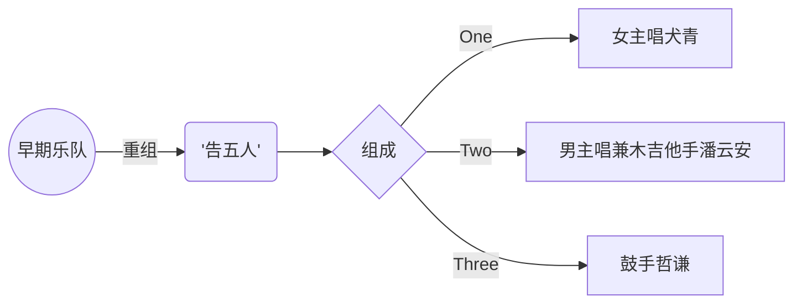

title: "抒情摇滚：告五人"
date: 2022-12-30T14:28:09-05:00
author: "孟维琦"
slug: Music
draft: false
toc: ture

# 知名歌曲

---

| 歌曲  | 创作时间  | 推荐值 | 经典片段 |
| :------------ |:---------------:| -----:| :-----------: |
| 《爱人错过》    |  2019年  | ⭐⭐⭐⭐⭐ | "我肯定在几百年前就说过爱你，只是你忘了我也没记起" |
| 《给我一瓶魔法药水》    |  2022年  |   ⭐⭐⭐⭐ | "给你一瓶魔法药水，喝下去就不需要氧气" |
| 《唯一》 | 2020年    |    ⭐⭐⭐⭐ | "眼神中飘移，总是在关键时刻清楚洞悉" |
| 《法兰西多士》 |  2019年  |    ⭐⭐⭐⭐⭐ | “共鸣产生的快感，快感横生的无奈” |

---

# 乐队组成：

# 歌曲欣赏

## 《爱人错过》

 
Title

    Contents ...  

## 《法兰西多士》

## 《带你去找夜生活》

# 乐队照片集锦























