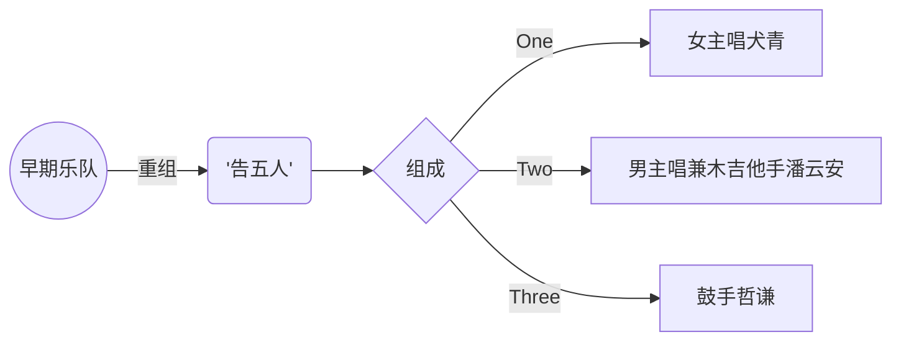


视频参考自B站[佐罗桑Zorro](https://space.bilibili.com/24192178?spm_id_from=333.337.search-card.all.click )及油管[相信音樂BinMusic](https://www.youtube.com/@binmusictaipei)，侵删！


# 知名歌曲

---

| 歌曲  | 创作时间  | 推荐值 | 经典片段 |
| :------------ |:---------------:| -----:| :-----------: |
| 《爱人错过》    |  2019年  | ⭐⭐⭐⭐⭐ | "我肯定在几百年前就说过爱你，只是你忘了我也没记起" |
| 《给我一瓶魔法药水》    |  2022年  |   ⭐⭐⭐⭐ | "给你一瓶魔法药水，喝下去就不需要氧气" |
| 《唯一》 | 2020年    |    ⭐⭐⭐⭐ | "眼神中飘移，总是在关键时刻清楚洞悉" |
| 《法兰西多士》 |  2019年  |    ⭐⭐⭐⭐⭐ | “共鸣产生的快感，快感横生的无奈” |

---

# 乐队组成：

# 歌曲欣赏

## 《爱人错过》

### 音频

> 现场视频:link:：

> 官方vedio:link:：

### 歌词大赏析

- **我肯定在几百年前就说过爱你，只是你忘了 我也没记起**：寄托着一种玄幻的:cupid:爱情[^1]依托与想象，时间与空间的集合，在某一刻又触碰出花火:stars:。
- **你妈没有告诉你，撞到人要说对不起，本来今天好好的；爱人就错过；爱人就错过**：略显戏谑地语气，怪怪的感觉，但是传递着最朴实无华的感情。有些时候，越简单直白地表述，越能带来亲切的共鸣，不要被自己的身份所拘束，这是理想化的，也是能做到的人寥寥的:balloon:。多少人为此错过、遗憾且无奈，几多感慨，化为一首《爱人错过》。

******度娘补充******
《我肯定在几百年前就说过爱你》除了谈论速食爱情外，也触及到了各种不同爱的切面，无论亲情、友情、爱情，都完整浓缩在了专辑里 。序曲《爱人错过》在迷幻摇滚的曲风之中，融入了“你妈没有告诉你，撞到人要说对不起”这样鬼马俏皮的小学生式歌词，使其具有了互联网传播的“网感”。
    《爱人错过》的创作是在一次观影后的灵感迸发，潘云安在看完日本导演新海诚执导的电影《你的名字》后，在回家时边骑机车边喃喃自语，于是诞生了该曲的第一句歌词“我肯定在几百年前就说过爱你”，这句歌词同时也是该曲所属专辑的名字。除此之外，潘云安还将儿时台湾省宜兰县复古的骂人说法“你妈没有跟你说喔，撞到人要说对不起，没看电视也要有常识”转化为了歌词。

## 《法兰西多士》

### 音频

> 现场视频:link:：

> 官方vedio:link:：

### 歌词大赏析

- **有人生来就肆无忌惮，所有问候都成为挚爱；有人生来为一人而活，所有善意都拒于门外**：有些人的终点可能是某些人的起点，无谓的比较，重要的是自己过得精彩，每个人有自己的境遇。
- **共鸣产生的快感，快感横生的无奈:disappointed_relieved:；投胎转世的期待，最后都变成麻烦:smiling_imp:**：精辟的语言概括了饮食男女们的心路历程，简而奢。“麻烦”何来？取其本质，思想使然，精神世界的培养无止境。当然，于个人而言，万不可取其共性而忽略个体的差异性，否则生搬硬套的所谓的“爱情准则”，如鱼饮水，冷暖自知:thought_balloon:咯！

******小插曲******
网传，这是[一首讲述出轨约炮心路历程的歌](https://www.zhihu.com/question/332126315)，哈哈哈。

## 《带我去找夜生活》

******说明******
入坑第一曲，超级有共鸣，就像“共鸣产生的快感，快感横生的无奈”一般

### 音频

> 现场视频：

> 官方vedio:link:：
>
> 官方vedio（健康版）:link:：

### 歌词大赏析

- **形同虚设的时间，在你眼里成为了无限；青春充满了不眠，是为了追寻更多的明天**：深夜失眠几多感伤，是为了更好的明天，轻松的人怎么会失眠呢？
- **如果你还没有睡，如果我还不停追；如果清醒是种罪，就把誓言带走 换承诺不回**：成年人的世界，多少讯息注入，但是自己的想法需要沉寂下来真正的沉淀；又是所谓的清醒，不过是糊弄自己的一份面具，戴久了 撕不下来了；轻易许下的那不是誓言，一拍而定的也谈不上理想。
- **如果你真是一切，如同我真是绝对，如果夜:new_moon:留下暧昧，让你我不再挂念，最后成全每个谁**：对于爱情[^1]，初恋有初恋的懵懂无知，白月光和朱砂痣，到底最后是谁成全了谁，有些问题可以逃避，但是有些问题，成年人必须直面，并且必须单独处理，这才是属于你的成人礼；慕然回首，无形之中已经改变了很多，很多...；懂得太多智商可能变成狗熊，还是把当下做好，思虑周全，尽力而为之，不留遗憾。

## 《给你一瓶魔法药水》

### 音频

> 现场视频:link:：

> 官方vedio:link:：

### 歌词大赏析

- **给你一瓶魔法药水，喝下去就不需要氧气**：寄托着一种玄幻的:cupid:爱情[^1]依托与想象。

- **我们一起去太空:moon:旅行，宇宙的有趣我才不在意，我在意的是 你牵我的手 而乱跳的心**：心境决定了心情，快乐源泉在于对的人。

# 乐队照片集锦

























------

[^1]: 古往今来人类从未研究透彻的一类话题